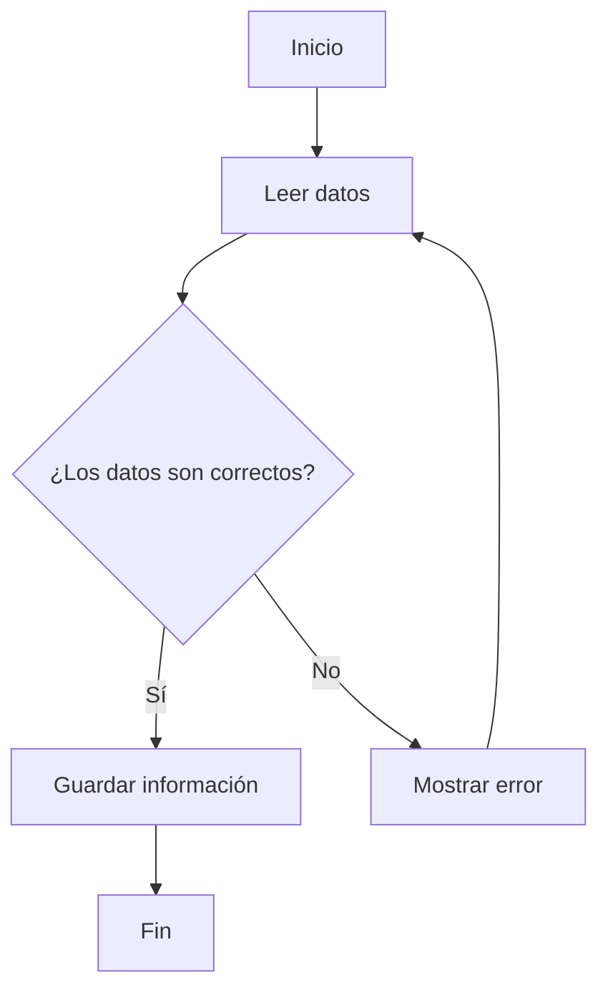
Dirección del diagrama
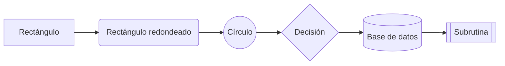
 
Formas de los nodos
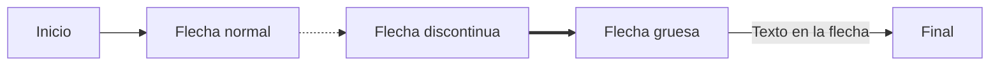
Tipos de flechas
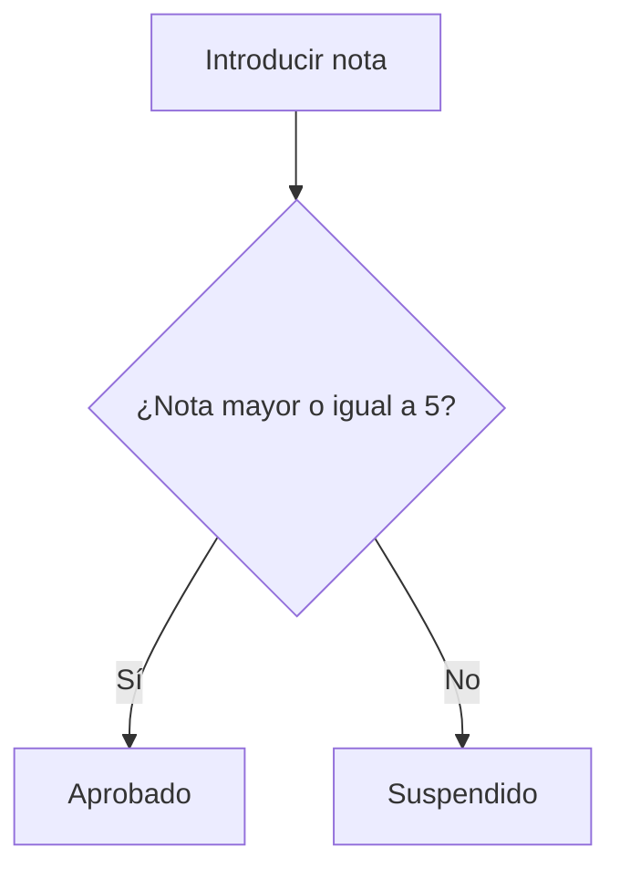
Condiciones
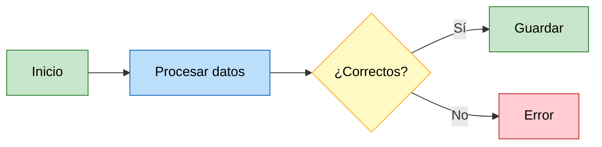
Colores y estilos
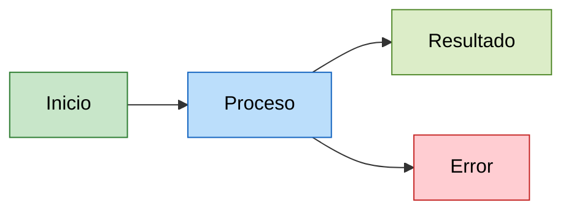
Agrupaciones con subgraph
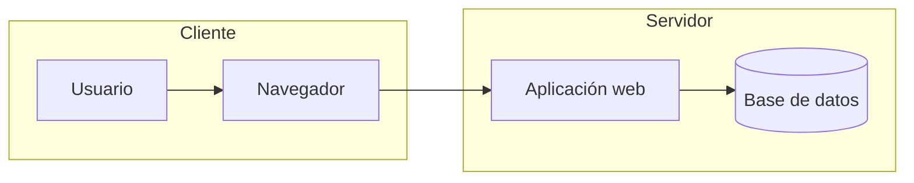
Diagrama de secuencia
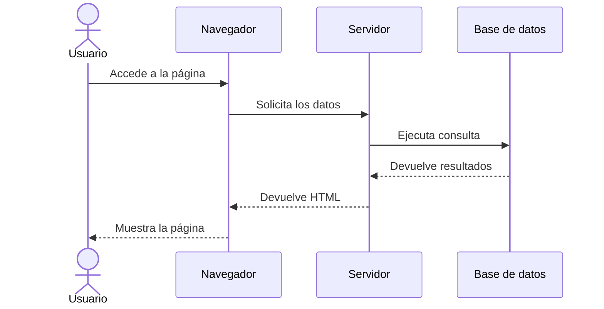
Diagrama de Clases
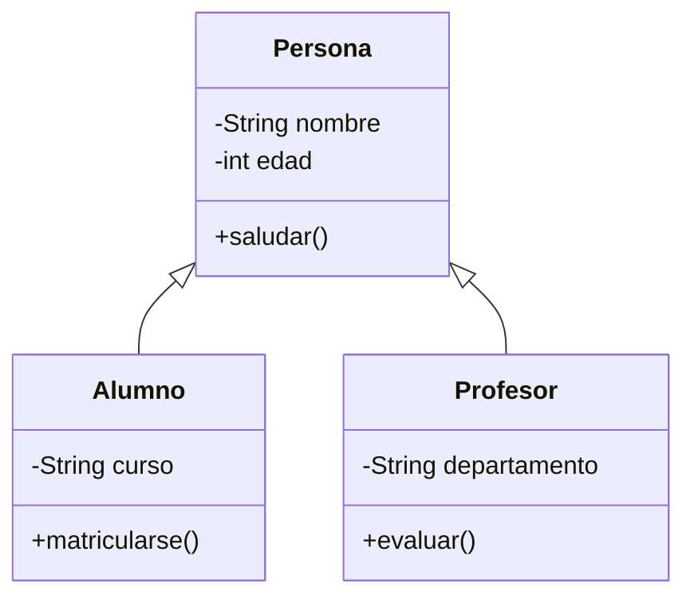
Diagrama ER
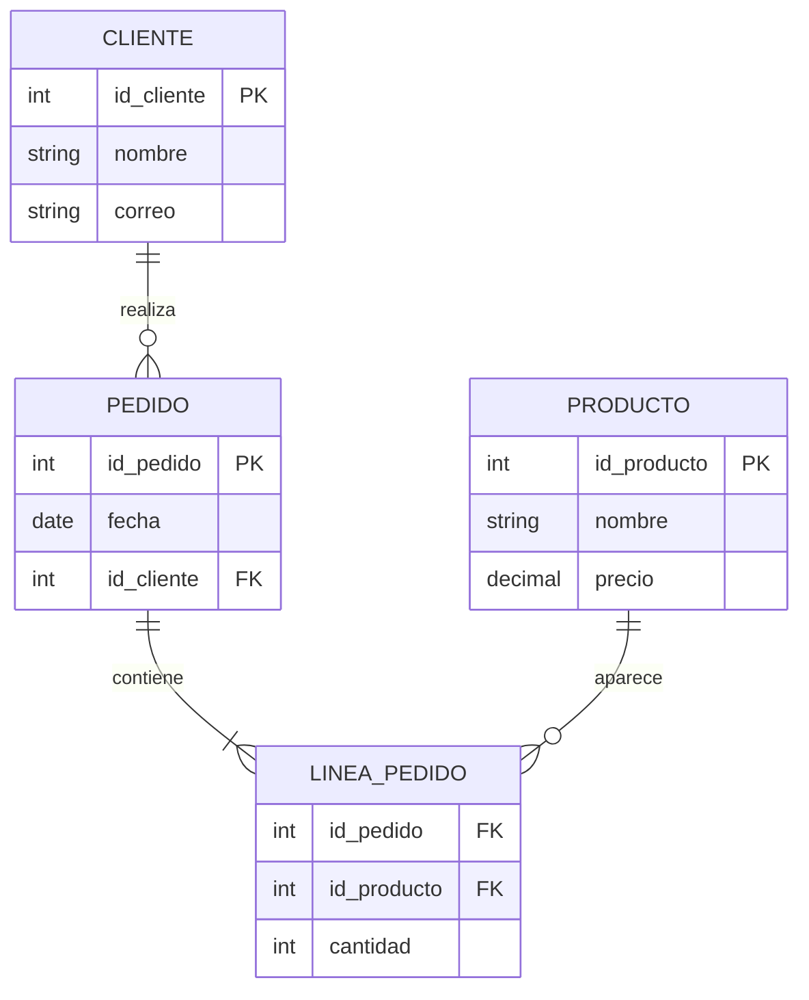
Diagrama de estado
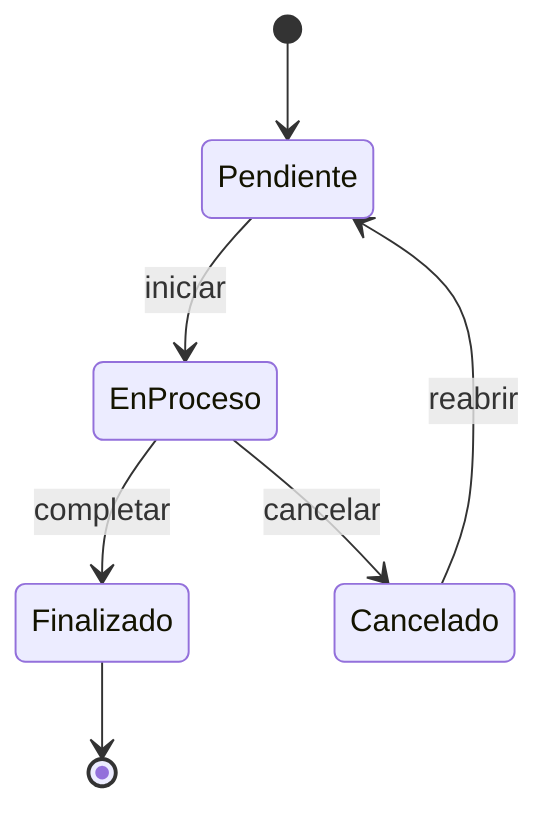
 
Diagrama de Gantt
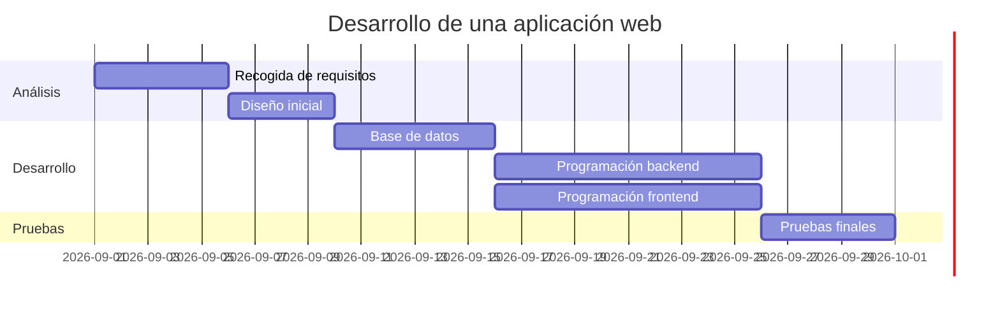
 
Mapa mental
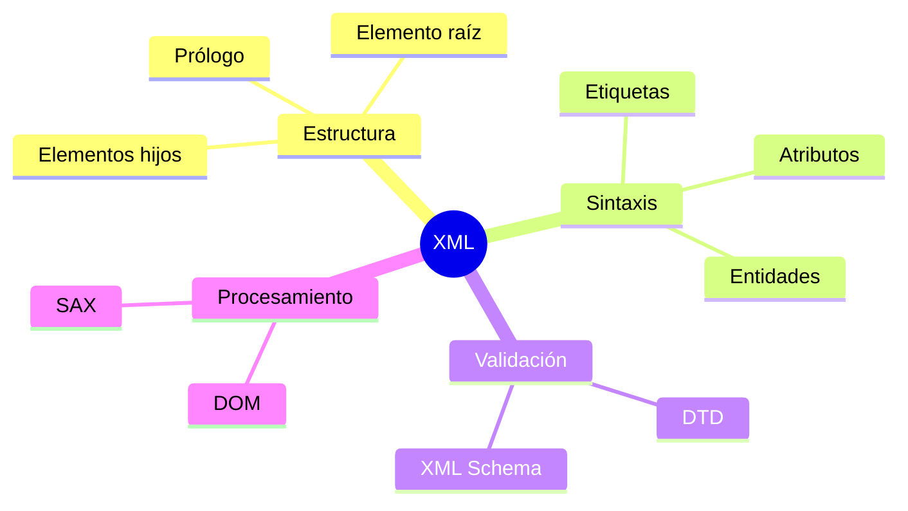
Línea del tiempo
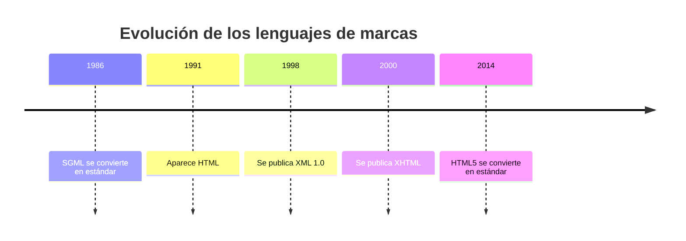
Gráfico circular
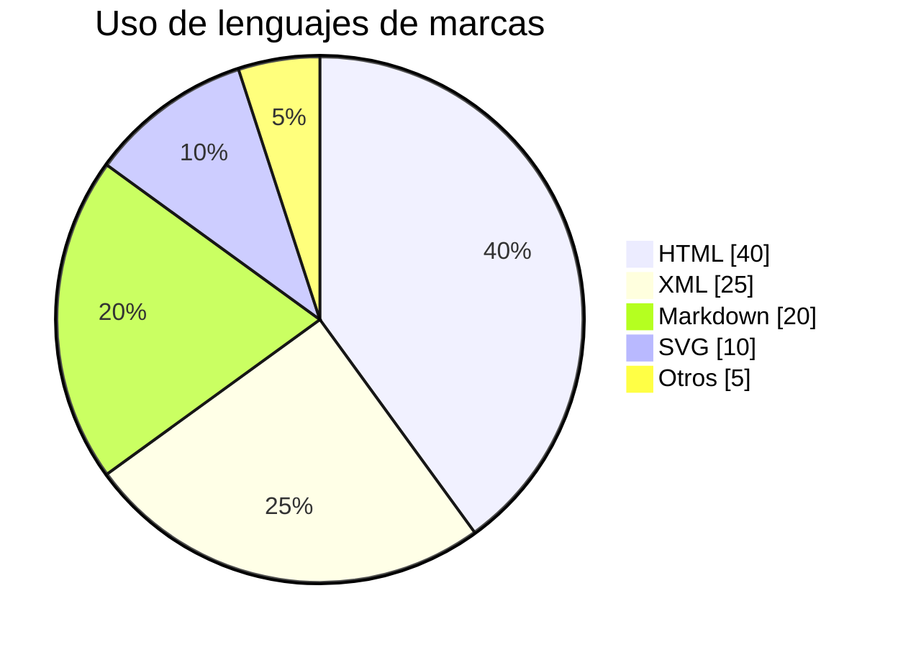
 
Diagrama de experiencia de usuario
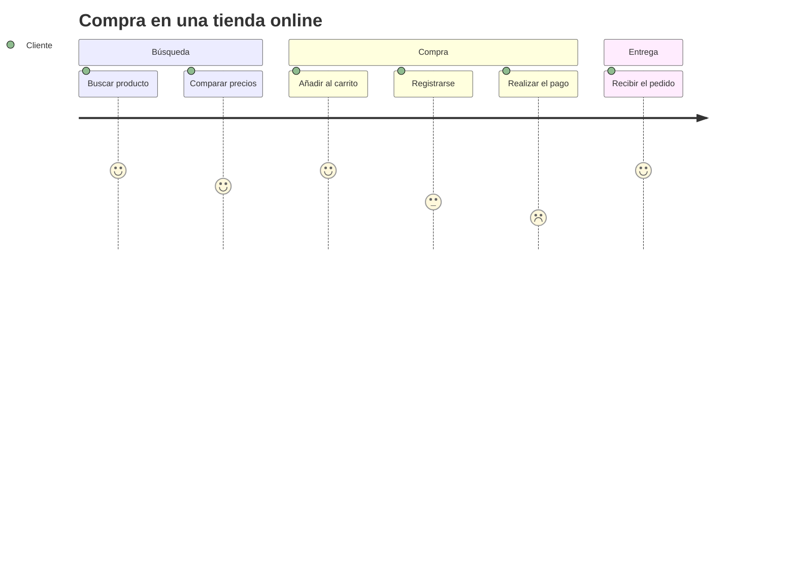
 
Diagrama Git
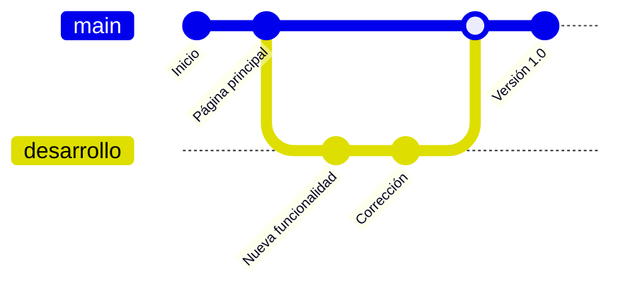