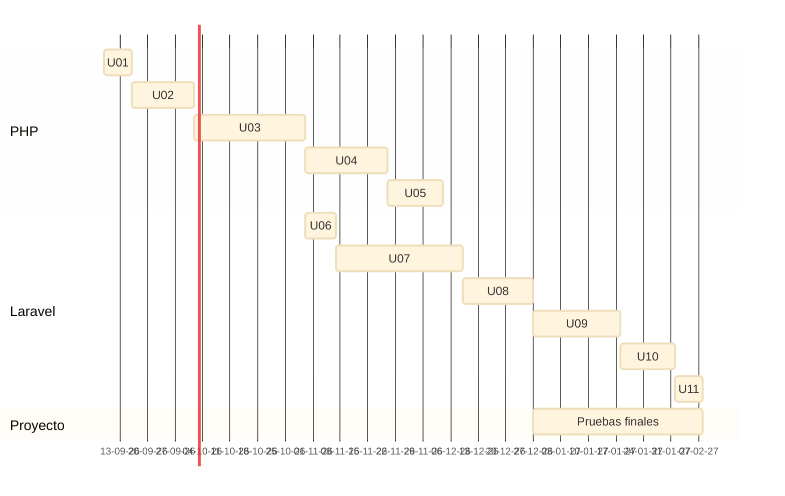

#  Curso 26-27 Planificación

### **Planificación temporal**

<table class="tabla-up">
  <tbody>
    <tr class="php">
      <td class="codigo">U01</td>
      <td>Arquitectura Web</td>
    </tr>
    <tr class="php">
      <td class="codigo">U02</td>
      <td>Lenguaje PHP</td>
    </tr>
    <tr class="php">
      <td class="codigo">U03</td>
      <td>PHP OO</td>
    </tr>
    <tr class="php">
      <td class="codigo">U04</td>
      <td>Programación Web</td>
    </tr>
    <tr class="php">
      <td class="codigo">U05</td>
      <td>Acceso a BD</td>
    </tr>

    <tr class="laravel">
      <td class="codigo">U06</td>
      <td>Entorno de Desarrollo Profesional</td>
    </tr>
    <tr class="laravel">
      <td class="codigo">U07</td>
      <td>Fundamentos</td>
    </tr>
    <tr class="laravel">
      <td class="codigo">U08</td>
      <td>Gestión de datos</td>
    </tr>
    <tr class="laravel">
      <td class="codigo">U09</td>
      <td>Interacción con usuario</td>
    </tr>
    <tr class="laravel">
      <td class="codigo">U10</td>
      <td>Autenticación básica</td>
    </tr>
    <tr class="laravel">
      <td class="codigo">U11</td>
      <td>Despliegue</td>
    </tr>
    <tr class="proyecto">
      <td class="codigo">Proyecto</td>
      <td>Pruebas finales</td>
    </tr>
  </tbody>
</table>

### **Calendario lectivo**

