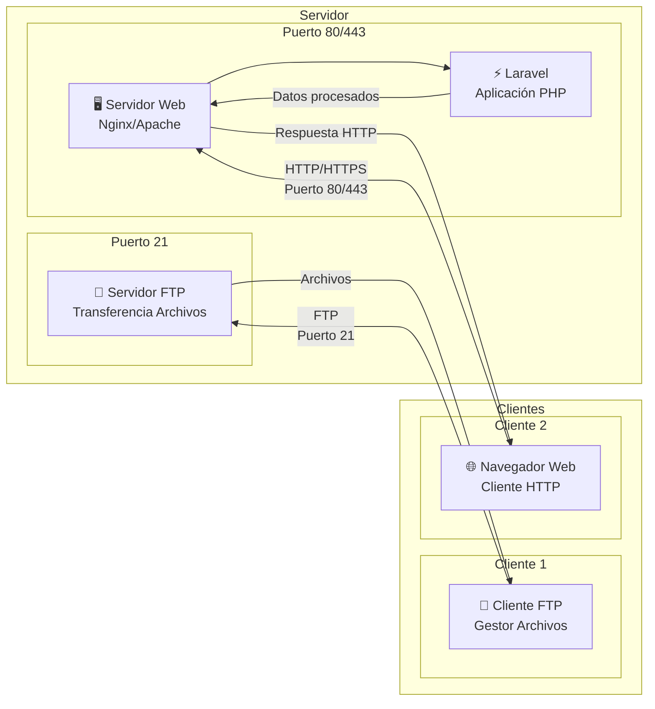

#  6.2. Funcionamiento de una app

Ahora que se ha presentado a Laravel como el "Chef", se necesita entender el "restaurante" donde trabaja: la web. Toda aplicación Laravel vive dentro de un ecosistema de comunicación bien definido conocido como la **arquitectura Cliente-Servidor**. Comprender este flujo es fundamental, porque es el camino exacto que recorre cada petición desde el usuario hasta el código y de vuelta.

## 2.1. La arquitectura cliente-servidor

Este modelo de comunicación es la espina dorsal de la web. En él, las responsabilidades se dividen claramente entre dos actores principales:

* **El Cliente**: Es quien inicia la comunicación. Su trabajo es **solicitar** recursos o servicios. En este contexto, el cliente por excelencia es el **navegador web** del usuario (Chrome, Firefox, Safari).
* **El Servidor**: Es quien está permanentemente escuchando y esperando esas peticiones. Se encarga de procesarlas, ejecutar la lógica necesaria y devolver una **respuesta**.

Dentro de un servidor pueden existir diferentes programas que están pendientes de las llamadas de los clientes. A estos programas, aunque suene redundante, también se les llama "servidores" o servicios. Algunos ejemplos podrían ser el servidor FTP, servidor DNS o servidor web.

Pero si un servidor (la máquina) tiene solo una dirección IP, ¿cómo sabe a qué programa se le envía la petición del cliente?

Para saber a qué servidor "programa" debe dirigirse cada petición del cliente, se establecen los puertos. Los puertos son un número que se asigna a cada servicio de modo que si una petición llega a dicho puerto, solo dicho servicio la atenderá.

Laravel se encuentra dentro de un **servidor web** que siempre está atendiendo peticiones de los clientes web, habitualmente por los puertos 80 y 443.

Cuando alguien visita la página web, en realidad está enviando una petición a este servidor, que procesa la solicitud y devuelve la respuesta correspondiente.


<div style="text-align: center;"><figure><figcaption class="figure-caption-small">🖼️ Figura 6.1: Peticiones a servidores los cuales procesan petición y envian respuesta</figcaption></figure></div>

Esta separación es lo que permite que la aplicación Laravel pueda atender a miles de usuarios simultáneamente. Cada conversación es un ciclo de petición y respuesta.

## 2.2. HTTP

Cliente y servidor necesitan un **idioma común** para entenderse. Ese idioma es el **Protocolo de Transferencia de Hipertexto (HTTP)**. Un **protocolo** es como un conjunto de reglas de etiqueta para la comunicación. Imagina que estás en una reunión internacional: todos deben seguir las mismas reglas sobre cuándo hablar, cómo saludar, etc., para que la comunicación funcione. HTTP es el "protocolo de etiqueta" que permite que los navegadores y servidores se entiendan perfectamente.

Hoy en día, la versión segura de este protocolo, **HTTPS (HTTP Secure)**, no es una opción, sino el estándar absoluto. HTTPS simplemente añade una capa de cifrado (TLS) a la comunicación, garantizando que los datos viajen de forma privada e íntegra. La aplicación Laravel, por defecto, funcionará sobre HTTPS.

**HTTPS** cifra toda la comunicación entre el navegador y el servidor Laravel. Esto significa que si alguien intercepta los datos (como una contraseña o información personal), no podrá leerlos. Los navegadores modernos marcan como "no seguras" las páginas que no usan HTTPS, y Google penaliza en sus resultados de búsqueda a los sitios sin cifrado.

### Los Métodos HTTP

Dentro del idioma HTTP, los **métodos** son los "**verbos**" que le indican al servidor la **intención** de la petición del cliente. En lugar de inventar acciones, REST aprovecha estos verbos estándar.

Cuando se trabaje con Laravel, se asociarán estos métodos a las operaciones CRUD (Crear, Leer, Actualizar, Borrar) de forma constante:

* **GET**: **Leer** un recurso. Es la acción más común. Cuando se escribe `midominio.com/usuarios` en el navegador, este envía una petición GET. Le está diciendo a Laravel: "**Dame** la lista de usuarios".
* **POST**: **Crear** un nuevo recurso. Cuando un usuario rellena un formulario de registro y pulsa "Enviar", el navegador envía una petición POST con los datos del nuevo usuario en el cuerpo. Le dice a Laravel: "**Crea** este usuario".
* **PUT / PATCH**: **Actualizar** un recurso existente. PUT reemplaza el recurso completo, mientras que PATCH aplica una modificación parcial. Le dicen a Laravel: "**Actualiza** los datos de este usuario".
* **DELETE**: **Eliminar** un recurso. Le dice a Laravel: "**Borra** este usuario".

**CRUD** es un acrónimo que significa **Create** (Crear), **Read** (Leer), **Update** (Actualizar) y **Delete** (Eliminar). Son las cuatro operaciones básicas que puedes realizar con cualquier recurso (como usuarios, productos, artículos, etc.). Laravel está diseñado para manejar estas operaciones de forma muy elegante y consistente.

Estos métodos son el corazón del sistema de **Enrutamiento** de Laravel. En el fichero `routes/web.php` del proyecto, se definirá explícitamente qué ruta y qué método HTTP debe ejecutar una porción del código. Por ejemplo: `Route::get('/usuarios', ...)` le dice a Laravel que escuche peticiones GET en la URL `/usuarios`.

## 2.3. El ciclo de vida completo de una petición a Laravel

Desde que un usuario pulsa "Enter" hasta que ve la página, ocurren una serie de pasos a la velocidad de la luz. Entender este viaje dará un contexto inmenso sobre cómo funciona todo.

**Escenario**: Un usuario escribe `https://miapplaravel.com/productos` en su navegador.

1. **Fase 1: Resolución (Cliente)**

   * **Resolución DNS**: El navegador no sabe dónde está `miapplaravel.com`. Pregunta al **DNS (Sistema de Nombres de Dominio)**, que actúa como la "agenda de contactos" de Internet, y este le responde con la dirección IP del servidor donde se aloja tu aplicación.
   * **Conexión TCP y TLS**: El navegador establece una conexión fiable (TCP) con esa IP en el puerto 443 (el estándar para HTTPS) y negocia una conexión cifrada (TLS handshake). Ya hay un canal seguro.

2. **Fase 2: La Petición (Cliente → Servidor)**

   * **Construcción de la Petición HTTP**: El navegador crea el mensaje de petición. Lo fundamental es:

     ``` http
     GET /productos HTTP/1.1
     Host: miapplaravel.com
     User-Agent: Mozilla/5.0...
     ```
   * Este mensaje viaja por Internet hasta tu servidor.

3. **Fase 3: Procesamiento (Servidor Laravel)**

   * **Recepción**: Un software servidor web (como Nginx o Apache) recibe la petición y, sabiendo que es para una aplicación PHP, la pasa al punto de entrada de Laravel (`public/index.php`).
   * **El Kernel de Laravel**: La petición entra al corazón de Laravel, que la dirige a través de una serie de *middlewares* (filtros de seguridad, autenticación, etc.).
   * **Enrutamiento**: Laravel consulta su "mapa" de rutas (`routes/web.php`) y ve que la petición `GET /productos` debe ser gestionada por el método `index` de la clase `ProductoController`.
   * **Lógica de Negocio**: El `ProductoController` se ejecuta. Le pide al **Modelo** `Producto` que recupere todos los productos de la base de datos.
   * **Generación de la Respuesta**: El controlador toma la lista de productos y la pasa a una **Vista** (una plantilla de Blade). Blade genera el HTML final.

     Los middlewares

     Son como filtros de seguridad que revisan cada petición antes de que llegue al código. Pueden verificar si el usuario está autenticado, si tiene permisos para acceder a cierta página, etc.

4. **Fase 4: La Respuesta (Servidor → Cliente)**

   * **Construcción de la Respuesta HTTP**: Laravel empaqueta el HTML generado en una respuesta HTTP, encabezada por un código de estado:

     ``` http
     HTTP/1.1 200 OK
     Content-Type: text/html; charset=UTF-8
     ...

     <html>...</html>
     ```
    El código `200 OK` le dice al navegador que todo ha ido bien.

5. **Fase 5: Renderizado (Cliente)**

   * **Interpretación**: El navegador recibe la respuesta, lee el HTML y renderiza la página visualmente para el usuario.
   * **Recursos Adicionales**: Si el HTML incluye referencias a archivos CSS, JavaScript o imágenes, el navegador iniciará nuevos ciclos de petición/respuesta para cada uno de ellos, hasta que la página esté completa.

HTTP es ***stateless***, lo que significa que **cada petición es un evento aislado e independiente**. El servidor no guarda ningún recuerdo de las peticiones anteriores de un mismo cliente. Para gestionar "estados" como un inicio de sesión o un carrito de la compra, Laravel construye una capa por encima de HTTP, usando mecanismos como las **sesiones** y las **cookies**, que sí recuerdan al usuario entre peticiones.
