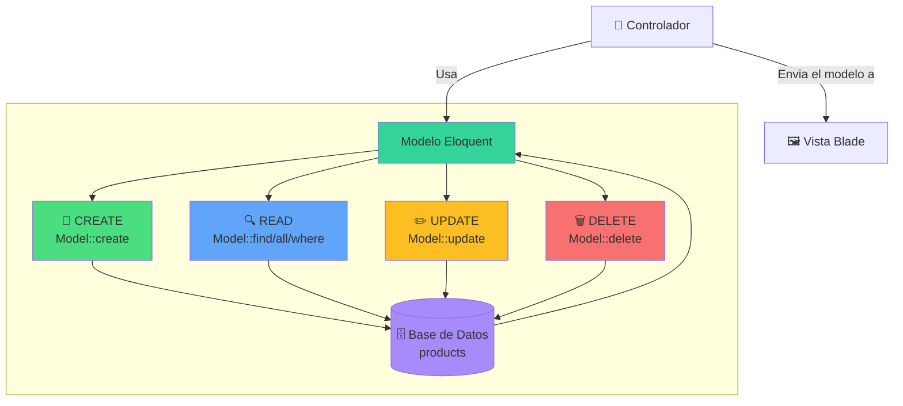

#  8.3. CRUD con Eloquent

Para gestionar los datos en una aplicación, es fundamental dominar las operaciones CRUD: Crear (Create), Leer (Read), Actualizar (Update) y Eliminar (Delete). Eloquent ORM de Laravel simplifica enormemente estas operaciones, proporcionando métodos intuitivos y potentes para interactuar con la base de datos.

## 3.1. Qué son las operaciones CRUD?

Como se vio en la sesión 2, con los controladores de tipo resource, Laravel ya proporciona una estructura básica para manejar las operaciones CRUD. Sin embargo, Eloquent lleva esto al siguiente nivel al ofrecer métodos específicos y optimizados para cada operación.

Los modelos cuentan con métodos integrados que facilitan la interacción con la base de datos, permitiendo realizar operaciones CRUD de manera sencilla y elegante.

Algunas de las operaciones CRUD más comunes incluyen:

| operación | Método Eloquent | SQL Equivalente |
| --- | --- | --- |
| **Create** | `Model::create()` | `INSERT INTO` |
| **Read** | `Model::find()`, `Model::all()` | `SELECT` |
| **Update** | `Model::update()` | `UPDATE` |
| **Delete** | `Model::delete()` | `DELETE` |


<figcaption class="figure-caption-small">🖼️ Figura 8.4: Crud con Eloquent</figcaption>


#### Interpretación del diagrama

Este diagrama muestra el flujo completo de las operaciones CRUD:

1. **Controlador** → Utiliza el modelo para iniciar una operación (CREATE, READ, UPDATE o DELETE).
2. **Eloquent** → Traduce la operación a SQL y la ejecuta en la base de datos.
3. **Base de Datos** → Procesa la operación y devuelve el resultado.
4. **Modelo Eloquent** → Convierte el resultado en un objeto PHP.
5. **Vista Blade** → Muestra los datos del objeto PHP al usuario.

**Todo el proceso ocurre de forma transparente** sin una sola línea de SQL.

## 3.2. Operación CREATE (Crear)

La operación CREATE permite insertar nuevos registros en la base de datos. Para esto, Eloquent proporciona varios métodos que facilitan la creación de nuevos registros.

### 3.2.1. Métodos para crear registros

Si solo se necesita crear un registro, se pueden usar los siguientes métodos:

```php
<?php

// Método 1: crear y guardar manualmente
$product = new Product();
$product->name = 'iPhone 15';
$product->description = 'Último modelo de iPhone';
$product->price = 999.99;
$product->category_id = 1;
$product->save(); // Hasta que no se llame a save(), no se guarda en la base de datos
```

```php
<?php

// Método 2: crear directamente y guardar (create)
$product = Product::create([
    'name' => 'iPhone 15',
    'description' => 'Último modelo de iPhone',
    'price' => 999.99,
    'category_id' => 1
]);
```

```php
<?php

// Método 3: crear sin guardar (make)
$product = Product::make([
    'name' => 'iPhone 15',
    'description' => 'Último modelo de iPhone',
    'price' => 999.99,
    'category_id' => 1
]);
$product->save(); // Guardar cuando sea necesario
```

**Asignación masiva y seguridad**

Se debe asegurar que el modelo tenga la propiedad `$fillable` o `$guarded` correctamente configurada para permitir la asignación masiva cuando se usa `create()` o `make()`.

### 3.2.2. Crear múltiples registros

También es posible crear múltiples registros a la vez. Para ello se puede usar un array de arrays:

```php
<?php

// crear múltiples productos
$products = Product::create([
    [
        'name' => 'iPhone 15',
        'price' => 999.99,
        'category_id' => 1
    ],
    [
        'name' => 'Samsung Galaxy',
        'price' => 899.99,
        'category_id' => 1
    ],
    [
        'name' => 'iPad Pro',
        'price' => 1099.99,
        'category_id' => 1
    ]
]);
```

## 3.3. Operación READ (Leer)

Para leer datos de la base de datos, Eloquent ofrece una variedad de métodos para recuperar registros de manera eficiente.

### 3.3.1. Consultas básicas

Algunas de las consultas más comunes incluyen:

```php
<?php

// Obtener todos los registros
$products = Product::all();

// Obtener un registro por ID
$product = Product::find(1);

// Obtener un registro o fallar. Lanza una excepción si no existe
$product = Product::findOrFail(1);

// Obtener el primer registro
$product = Product::first();

// Se posiciona en el último registro y lo obtiene
$product = Product::latest()->first();

// Contar registros
$count = Product::count();
```

### 3.3.2. Consultas con condiciones

Lo más habitual en las consultas es filtrar los resultados con condiciones. Eloquent también proporciona métodos intuitivos para esto:

```php
<?php

// WHERE básico
$products = Product::where('category_id', 1)->get();

// WHERE con múltiples condiciones con AND
$products = Product::where('category_id', 1)
                   ->where('price', '>', 100)
                   ->get();

// WHERE con OR
$products = Product::where('category_id', 1)
                   ->orWhere('category_id', 2)
                   ->get();

// WHERE IN
$products = Product::whereIn('category_id', [1, 2, 3])->get();

// WHERE LIKE
$products = Product::where('name', 'like', '%iPhone%')->get();

// WHERE BETWEEN
$products = Product::whereBetween('price', [100, 500])->get();

// WHERE NULL
$products = Product::whereNull('deleted_at')->get();

// Verificar si existe
$exists = Product::where('name', 'iPhone 15')->exists();
```

### 3.3.3. Ordenamiento y limitación

Por otro lado, es común ordenar y limitar los resultados:

```php
<?php

// Ordenar por un campo
$products = Product::orderBy('price', 'desc')->get();
$products = Product::orderBy('name', 'asc')->get();

// Ordenar por múltiples campos
$products = Product::orderBy('category_id')
                   ->orderBy('price', 'desc')
                   ->get();

// Devolver un número limitado de registros
$products = Product::take(10)->get();

// Saltar un número de registros (offset)
$products = Product::skip(10)->get();
```

**Encadenamiento de métodos**

Eloquent permite encadenar múltiples métodos para construir consultas complejas de manera legible y fluida.

```php
<?php

$products = Product::where('category_id', 1)
                   ->where('price', '>', 100)
                   ->orderBy('price', 'desc')
                   ->take(10)
                   ->get();
```

### 3.3.4 Paginación simple y avanzada

Laravel ofrece dos métodos de paginación para manejar grandes conjuntos de datos. La diferencia reside en la cantidad de información que se obtiene según el método utilizado.

```php
<?php

// Paginación completa con enlaces (anterior, siguiente, números de página)
$products = Product::paginate(15);

// Paginación simple (solo anterior/siguiente, más rápida)
$products = Product::simplePaginate(15);
```

| Característica | `paginate()` | `simplePaginate()` |
| --- | --- | --- |
| **Números de página** | ✅ Todos los números | ❌ Solo anterior/siguiente |
| **Conteo total** | ✅ Muestra total de registros | ❌ No cuenta |
| **Rendimiento** | Más lento (cuenta registros) | Más rápido |
| **Uso recomendado** | Listados completos | Feeds infinitos, móviles |

Para mostrar los enlaces de paginación en la vista Blade, se utiliza el método `links()`:

```php
<?php

@foreach($products as $product)
    {{ -- Contenido -- }}
@endforeach

{{ $products->links() }} {{ -- Genera los enlaces automáticamente -- }}
```

### 3.4. Consultas avanzadas
Eloquent también soporta consultas más avanzadas como selecciones específicas, agrupamientos, uniones y subconsultas. Aunque estas son menos comunes, son muy útiles en casos específicos.

```php
<?php

// SELECT específico
$products = Product::select('name', 'price')->get();

// GROUP BY
$products = Product::groupBy('category_id')
                   ->selectRaw('category_id, count(*) as total')
                   ->get();

// HAVING
$products = Product::groupBy('category_id')
                   ->having('count', '>', 5)
                   ->get();

// JOIN
$products = Product::join('categories', 'products.category_id', '=', 'categories.id')
                   ->select('products.*', 'categories.name as category_name')
                   ->get();

// Subconsultas
$products = Product::where('price', '>', function($query) {
    $query->selectRaw('AVG(price)')
          ->from('products');
})->get();
```

## 3.4. Operación UPDATE (actualizar)

Para actualizar registros existentes, Eloquent proporciona métodos que permiten modificar uno o varios registros de manera sencilla.

Basicamente, es muy similar a la operación CREATE, pero en este caso se trabaja con registros ya existentes. La principal diferencia al llamar al método `save()` es que Eloquent detecta si el modelo ya existe en la base de datos (tiene un ID) y realiza una operación `UPDATE` en lugar de `INSERT`.

### 3.4.1. Actualizar registros individuales

```php
<?php

// Método 1: Actualizar por instancia
$product = Product::find(1);
$product->name = 'iPhone 15 Pro';
$product->price = 1099.99;
$product->save();
```

```php
<?php

// Método 2: Actualizar directamente
Product::where('id', 1)->update([
    'name' => 'iPhone 15 Pro',
    'price' => 1099.99
]);
```

```php
<?php

// Método 3: Actualizar o crear
$product = Product::updateOrCreate(
    ['name' => 'iPhone 15'],
    ['price' => 999.99]
);
```

### 3.4.2. Actualizar múltiples registros

```php
<?php

// Actualizar múltiples registros
Product::where('category_id', 1)->update([
    'is_active' => true
]);

// Actualizar con incremento/decremento
Product::where('category_id', 1)->increment('price', 10);
Product::where('category_id', 1)->decrement('price', 5);

// Actualizar con condiciones
Product::where('price', '<', 100)->update([
    'is_discounted' => true
]);
```

### 3.4.3. Crear o actualizar (Upsert)
Esta función combina la creación y actualización en una sola operación. Si el registro existe (basado en condiciones), se actualiza; si no, se crea uno nuevo.

```php
<?php

// crear o actualizar basado en condiciones
$product = Product::updateOrCreate(
    ['name' => 'iPhone 15'], // Condiciones para buscar
    [
        'price' => 999.99,
        'category_id' => 1
    ] // Datos para crear o actualizar
);

// crear o actualizar múltiples registros
Product::upsert([
    ['name' => 'iPhone 15', 'price' => 999.99],
    ['name' => 'Samsung Galaxy', 'price' => 899.99]
], ['name'], ['price']); // name es la clave única, price se actualiza
```

## 3.5. Operación DELETE (eliminar)

La ultima operación CRUD es eliminar registros. Eloquent ofrece métodos para eliminar uno o varios registros de manera segura.

### 3.5.1. Eliminar registros individuales

```php
<?php

// Método 1: Eliminar por instancia
$product = Product::find(1);
$product->delete();

// Método 2: Eliminar directamente
Product::destroy(1);

// Método 3: Eliminar múltiples por ID
Product::destroy([1, 2, 3]);

// Método 4: Eliminar con condiciones
Product::where('price', '<', 50)->delete();
```

**Soft Deletes (eliminación suave)**

Los **Soft Deletes** permiten "eliminar" registros sin borrarlos físicamente (se marcan con `deleted_at`). Esto es útil para mantener un historial y poder restaurar datos si es necesario. Para usar Soft Deletes, se debe agregar el trait `SoftDeletes` al modelo y asegurarse de que la tabla tenga una columna `deleted_at`.

### 3.5.2. Eliminar con relaciones

Cuando se trabaja con relaciones, es importante manejar las eliminaciones de manera adecuada para mantener la integridad referencial.

Se debe definir el comportamiento de las relaciones en los modelos (por ejemplo, `onDelete('cascade')` en las migraciones) para que al eliminar un registro, se eliminen o actualicen los registros relacionados según sea necesario.

```php
<?php

// Eliminar en cascada (definido en migración)
$category = Category::find(1);
$category->delete(); // Elimina todos los productos relacionados

// Eliminar con verificación
$product = Product::find(1);
if ($product->orders()->count() == 0) {
    $product->delete();
} else {
    // No se puede eliminar, tiene pedidos
}
```

## 3.6. Mejores prácticas

### 3.6.1. Optimización de consultas

En ocasiones, las consultas pueden volverse ineficientes si no se optimizan correctamente. Por ejemplo, el problema N+1 ocurre cuando se realizan múltiples consultas adicionales para cargar relaciones.

En este se están recogiendo todos los productos y luego, para cada producto, se hace una consulta adicional para obtener su categoría. Esto puede generar muchas consultas innecesarias.

La solución es usar **Eager Loading** con el método `with()` para cargar las relaciones de manera anticipada en una sola consulta. En este caso, se carga la categoría de todos los productos en una sola consulta adicional.

Ademas se puede optimizar aún más seleccionando solo los campos necesarios en lugar de cargar todos los datos ya que esto reduce la cantidad de datos transferidos, mejora el rendimiento y asegura la privacidad de los datos.


=== "❌ Problema N+1"
    ```php
    <?php

    $products = Product::all();
    foreach ($products as $product) {
        echo $product->category->name; // Consulta adicional por cada producto
    }
    ```

=== "✅ Eager Loading"
    ```php
    <?php

    $products = Product::with('category')->get();
    foreach ($products as $product) {
        echo $product->category->name; // Sin consultas adicionales
    }
    ```
=== "🔝 Seleccionar solo campos necesarios"
    ```php
    <?php

    $products = Product::with('category:id,name')
                    ->select('id', 'name', 'category_id')
                    ->get();
    ```

## 3.7. Trabajando con Collections

Cuando se realizan consultas con Eloquent, el resultado no es un array simple, sino una **Collection** (colección). Las Collections son objetos potentes que ofrecen métodos útiles para manipular y verificar datos.


### 3.7.2. Métodos esenciales de Collection

```php
<?php

// Obtener productos (devuelve una Collection)
$products = Product::all();

// Verificar si la colección está vacía
if ($products->isEmpty()) {
    echo "No hay productos";
}

// Verificar si la colección tiene elementos (MUY USADO EN VISTAS)
if ($products->isNotEmpty()) {
    echo "Hay productos disponibles";
}

// Contar elementos
$total = $products->count();

// Obtener el primer elemento
$firstProduct = $products->first();

// Obtener el último elemento
$lastProduct = $products->last();

// Filtrar elementos
$expensiveProducts = $products->filter(function($product) {
    return $product->price > 100;
});

// Mapear/transformar elementos
$productNames = $products->map(function($product) {
    return $product->name;
});

// Verificar si contiene un elemento
$hasProduct = $products->contains('id', 1);

// Sumar valores
$totalPrice = $products->sum('price');

// Obtener valores únicos
$uniqueCategories = $products->pluck('category_id')->unique();
```

### 3.7.3. Uso en Controladores y Vistas

**En el Controlador:**

```php
<?php

public function index()
{
    $products = Product::with('category')->get(); // Devuelve Collection
    
    return view('products.index', [
        'products' => $products
    ]);
}
```

**En las vistas Blade:**

```html
{{ -- Verificar si hay productos usando Collection -- }}
@if($products->isNotEmpty())
    <div class="grid">
        @foreach($products as $product)
            <x-product-card :product="$product" />
        @endforeach
    </div>
@else
    <p>No hay productos disponibles</p>
@endif

{{ -- Mostrar contador -- }}
<p>Total de productos: {{ $products->count() }}</p>

{{ -- Verificar si está vacío -- }}
@if($products->isEmpty())
    <div class="alert">
        No se encontraron productos
    </div>
@endif
```
