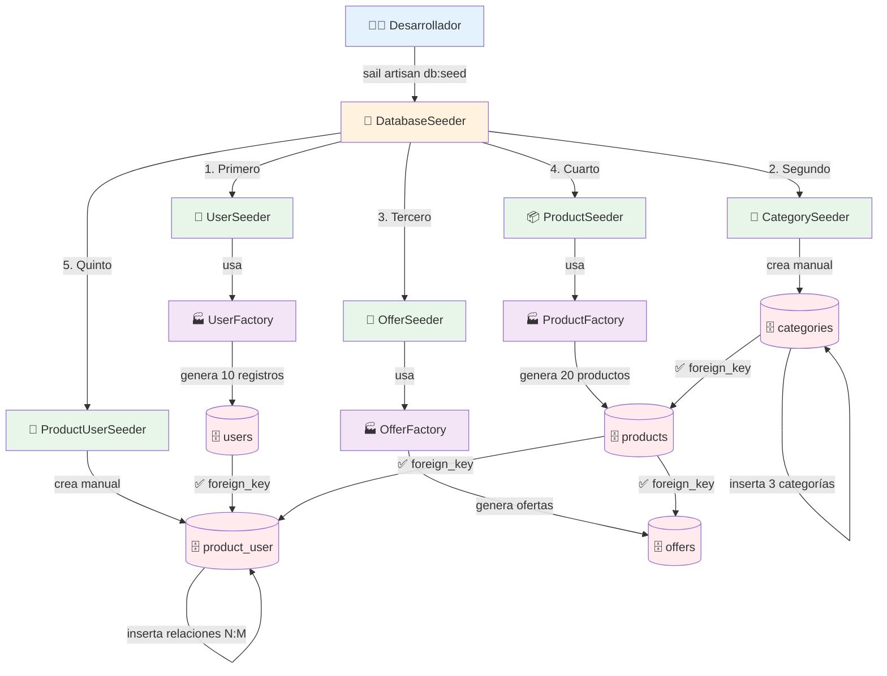

#  8.5. Seeders y Factories

Una vez que se ha aprendido a gestionar la estructura de la base de datos con migraciones y a interactuar con los datos mediante Eloquent ORM, el siguiente paso es poblar la base de datos con datos iniciales y de prueba. Esto se logra utilizando **seeders** y **factories**, herramientas que permiten automatizar la creación de grandes cantidades de datos realistas para facilitar el desarrollo y las pruebas.

## 5.1. Qué son los Seeders?

Los **seeders** son clases que definen datos iniciales para poblar la base de datos con información fija o de prueba. Permiten establecer un estado inicial consistente de la base de datos para desarrollo y testing.


¡Los seeders son como el plan de adquisición inicial que asegura que tu biblioteca tenga todo lo esencial desde el día uno!

## 5.2. Creando Seeders

### 5.2.1. Comando para crear Seeders

Para crear un seeder, se utiliza el comando Artisan **`make:seeder`** seguido del nombre del seeder.

```bash
# Crear un seeder básico
sail artisan make:seeder CategorySeeder
```

### 5.2.2. Estructura básica de un Seeder
Una vez creado, un seeder tiene una estructura básica con un método `run()` donde se define la lógica para insertar datos en la base de datos.

```php
<?php

namespace Database\Seeders;

use Illuminate\Database\Seeder;
use App\Models\Category;

class CategorySeeder extends Seeder
{
    /**
     * Run the database seeds.
     */
    public function run(): void
    {
        // Lógica para poblar la base de datos
    }
}
```

### 5.2.3. Seeder básico con datos estáticos

Dentro del método `run()`, se pueden insertar datos manualmente utilizando los modelos Eloquent. Para ello lo mas conveniente es tener un arreglo con los datos y luego iterar sobre él para crear los registros.

```php
<?php

namespace Database\Seeders;

use Illuminate\Database\Seeder;
use App\Models\Category;

class CategorySeeder extends Seeder
{
    public function run(): void
    {
        $categories = [
            [
                'name' => 'Electrónica',
                'slug' => 'electronica',
                'description' => 'Dispositivos electrónicos de última generación'
            ],
            [
                'name' => 'Ropa',
                'slug' => 'ropa',
                'description' => 'Moda y accesorios para todas las estaciones'
            ],
            [
                'name' => 'Hogar',
                'slug' => 'hogar',
                'description' => 'Artículos para el hogar y decoración'
            ]
        ];

        foreach ($categories as $category) {
            Category::create($category);
        }
    }
}
```

### 5.2.4. Seeder con relaciones
Los seeders también pueden crear datos que dependan de otros registros, respetando las relaciones definidas en la base de datos.

Por ejemplo, un `ProductSeeder` que crea productos asociados a categorías y ofertas existentes. Se muestra a continuación un ejemplo de un seeder que crea categorías, productos y ofertas, respetando las relaciones entre ellos.

```php
<?php

namespace Database\Seeders;

use Illuminate\Database\Seeder;
use App\Models\Category;
use App\Models\Product;
use App\Models\Offer;

class ProductSeeder extends Seeder
{
    public function run(): void
    {
        // Crear categorías
        $electronics = Category::create([
            'name' => 'Electrónica',
            'slug' => 'electronica'
        ]);

        $clothing = Category::create([
            'name' => 'Ropa',
            'slug' => 'ropa'
        ]);

        // Crear productos
        $iphone = Product::create([
            'name' => 'iPhone 15',
            'description' => 'Último modelo de iPhone',
            'price' => 999.99,
            'category_id' => $electronics->id
        ]);
        
        // Crear oferta para el iPhone
        Offer::create([
            'product_id' => $iphone->id,
            'discount_price' => 799.99,
            'start_date' => now(),
            'end_date' => now()->addDays(7)
        ]);

        $shirt = Product::create([
            'name' => 'Camiseta Premium',
            'description' => 'Camiseta de algodón orgánico',
            'price' => 29.99,
            'category_id' => $clothing->id
        ]);
    }
}
```

!!!tenencuenta "Atención"
    Este seeder crea multiples entidades en un mismo seeder. En aplicaciones reales, **es recomendable separar cada entidad en su propio seeder** para mantener el código limpio y modular.

## 5.3. Qué son las Factories?

Cuando los seeders necesitan crear grandes cantidades de datos que no son fijos, las factories son la herramienta ideal para generar estos datos ya que permiten definir patrones y variaciones en los datos generados.

Las **factories** son clases que generan datos de prueba realistas de forma automatizada. Utilizan la librería `Faker` para crear datos variados y creíbles para desarrollo y testing.


¡Las factories son tu imprenta automática que llena la biblioteca con contenido realista para probar todo el sistema!

## 5.4. Creando Factories

### 5.4.1. Comando para crear Factories

Para crear una factory, se utiliza el comando Artisan **`make:factory`** seguido del nombre de la factory y opcionalmente el modelo asociado.

Si se especifica el modelo, la factory se vincula automáticamente a ese modelo, facilitando la creación de instancias del mismo.

```bash
# Crear un factory básico
sail artisan make:factory ProductFactory

# Crear factory con modelo especificado
sail artisan make:factory ProductFactory --model=Product
```

### 5.4.2. Estructura básica de una Factory

Los factories tienen una estructura básica que incluye un método `definition()` donde se definen los atributos del modelo y cómo se generan sus valores utilizando Faker.

```php
<?php

namespace Database\Factories;

use Illuminate\Database\Eloquent\Factories\Factory;
use App\Models\Category;

class ProductFactory extends Factory
{
    /**
     * Define the model's default state.
     */
    public function definition(): array
    {
        // Definir los atributos con datos generados por Faker
    }
}
```

### 5.4.3. Factory básico con datos realistas

Los factories deben definir atributos con datos generados por Faker para crear registros variados y realistas.

Por ejemplo, una factory para el modelo `Product` podría verse así:

```php
<?php

namespace Database\Factories;

use Illuminate\Database\Eloquent\Factories\Factory;
use App\Models\Category;

class ProductFactory extends Factory
{
    public function definition(): array
    {
        return [
            'name' => $this->faker->randomElement([
                'iPhone 15 Pro',
                'Samsung Galaxy S24',
                'MacBook Air M3',
                'iPad Pro 12.9"',
                'AirPods Pro',
                'Apple Watch Series 9'
            ]),
            'description' => $this->faker->paragraph(3),
            'price' => $this->faker->randomFloat(2, 99, 1999),
            'category_id' => Category::factory(),
            'image' => $this->faker->imageUrl(400, 300, 'products'),
            'is_active' => $this->faker->boolean(90), // 90% activos
        ];
    }
}
```

#### Faker

Faker es una librería que genera datos falsos pero realistas, como nombres, direcciones, textos, números, fechas, etc. Laravel la integra para facilitar la creación de datos de prueba.

Más info: [**Faker PHP**](https://fakerphp.github.io/){:target="blank"}.

???teolaravel "Tabla de Faker más comunes"

    | Categoría                   | Método Faker                                      | Tipo de dato | Ejemplo generado                              | Uso habitual / Comentario                                           |
    | --------------------------- | ------------------------------------------------- | ------------ | --------------------------------------------- | ------------------------------------------------------------------- |
    | **Texto básico**            | `$this->faker->word()`                            | string       | `"mesa"`                                      | Palabra suelta, útil para nombres cortos de productos o categorías. |
    |                             | `$this->faker->sentence()`                        | string       | `"El producto es de gran calidad."`           | Una frase aleatoria; ideal para descripciones.                      |
    |                             | `$this->faker->paragraph()`                       | string       | `"Lorem ipsum dolor sit amet..."`             | Texto más largo, para campos tipo “detalle” o “biografía”.          |
    |                             | `$this->faker->text(100)`                         | string       | `"Innovador sistema de ahorro de energía..."` | Texto de longitud controlada.                                       |
    
    
    | Categoría                   | Método Faker                                      | Tipo de dato | Ejemplo generado                              | Uso habitual / Comentario                                           |
    | --------------------------- | ------------------------------------------------- | ------------ | --------------------------------------------- | ------------------------------------------------------------------- |
    | **Personas y usuarios**     | `$this->faker->name()`                            | string       | `"Raúl García"`                               | Nombre completo.                                                    |
    |                             | `$this->faker->firstName()`                       | string       | `"Laura"`                                     | Nombre de pila.                                                     |
    |                             | `$this->faker->lastName()`                        | string       | `"Martínez"`                                  | Apellido.                                                           |
    |                             | `$this->faker->firstNameMale()`                   | string       | `"Arturo"`                                    | Nombre masculino.                                                   |
    |                             | `$this->faker->firstNameFemale()`                 | string       | `"Alba"`                                      | Nombre femenino.                                                    |
    |                             | `$this->faker->title()`                           | string       | `"Sr"` / "Sra."`                              | Título aleatorio.                                                   |
    |                             | `$this->faker->titleMale()`                       | string       | `"Sr"`                                        | Título masculino.                                                   |
    |                             | `$this->faker->titleFemale()`                     | string       | `"Sra."`                                      | Título femenino.                                                    |
    |                             | `$this->faker->userName()`                        | string       | `"lmartinez87"`                               | Nombre de usuario.                                                  |
    |                             | `$this->faker->email()`                           | string       | `"raul@example.com"`                          | Correo electrónico.                                                 |
    |                             | `$this->faker->safeEmail()`                       | string       | `"maria@test.com"`                            | Correo seguro (no real).                                            |
    |                             | `$this->faker->unique()->email()`                 | string       | `"cliente1@example.com"`                      | Asegura que no se repitan correos.                                  |
    |                             | `$this->faker->phoneNumber()`                     | string       | `"+34 687 234 556"`                           | Teléfono realista, formato variable.                                |
    
    
    | Categoría                   | Método Faker                                      | Tipo de dato | Ejemplo generado                              | Uso habitual / Comentario                                           |
    | --------------------------- | ------------------------------------------------- | ------------ | --------------------------------------------- | ------------------------------------------------------------------- |
    | **Direcciones y lugares**   | `$this->faker->address()`                         | string       | `"Calle Mayor, 12, Valencia"`                 | Dirección completa.                                                 |
    |                             | `$this->faker->city()`                            | string       | `"Alginet"`                                   | Ciudad.                                                             |
    |                             | `$this->faker->country()`                         | string       | `"España"`                                    | País.                                                               |
    |                             | `$this->faker->postcode()`                        | string       | `"46230"`                                     | Código postal.                                                      |
    
    | Categoría                   | Método Faker                                      | Tipo de dato | Ejemplo generado                              | Uso habitual / Comentario                                           |
    | --------------------------- | ------------------------------------------------- | ------------ | --------------------------------------------- | ------------------------------------------------------------------- |
    | **Internet y tecnología**   | `$this->faker->url()`                             | string       | `"https://example.com"`                       | Dirección web.                                                      |
    |                             | `$this->faker->ipv4()`                            | string       | `"192.168.0.15"`                              | IP local o pública.                                                 |
    |                             | `$this->faker->password()`                        | string       | `"A8s!x0qZ"`                                  | Contraseña aleatoria.                                               |
    |                             | `$this->faker->uuid()`                            | string       | `"d3f4a6e8-9c2a-11ec-b909-0242ac120002"`      | Identificador único global.                                         |
    
    | Categoría                   | Método Faker                                      | Tipo de dato | Ejemplo generado                              | Uso habitual / Comentario                                           |
    | --------------------------- | ------------------------------------------------- | ------------ | --------------------------------------------- | ------------------------------------------------------------------- |
    | **Fechas y tiempos**        | `$this->faker->date()`                            | date         | `"2025-11-06"`                                | Fecha aleatoria.                                                    |
    |                             | `$this->faker->time()`                            | time         | `"15:34:21"`                                  | Hora.                                                               |
    |                             | `$this->faker->dateTimeBetween('-1 year', 'now')` | datetime     | `"2024-09-12 08:23:11"`                       | Muy útil para “fecha de alta” o “fecha pedido”.                     |
    |                             | `$this->faker->dateTimeThisMonth()`               | datetime     | `"2025-11-03 19:45:00"`                       | Fechas recientes.                                                   |
    
    | Categoría                   | Método Faker                                      | Tipo de dato | Ejemplo generado                              | Uso habitual / Comentario                                           |
    | --------------------------- | ------------------------------------------------- | ------------ | --------------------------------------------- | ------------------------------------------------------------------- |
    | **Números y cantidades**    | `$this->faker->randomDigit()`                     | int          | `7`                                           | Dígito (0–9).                                                       |
    |                             | `$this->faker->randomNumber(3)`                   | int          | `382`                                         | Número con longitud definida.                                       |
    |                             | `$this->faker->numberBetween(10, 100)`            | int          | `64`                                          | Número en un rango concreto.                                        |
    |                             | `$this->faker->randomFloat(2, 1, 500)`            | float        | `87.35`                                       | Números con decimales, ideal para precios.                          |
    |                             | `$this->faker->boolean()`                         | bool         | `true`                                        | Verdadero o falso (50%).                                            |
    |                             | `$this->faker->boolean(20)`                       | bool         | `false`                                       | Probabilidad personalizada (20% de true).                           |
    
    
    | Categoría                   | Método Faker                                      | Tipo de dato | Ejemplo generado                              | Uso habitual / Comentario                                           |
    | --------------------------- | ------------------------------------------------- | ------------ | --------------------------------------------- | ------------------------------------------------------------------- |
    | **Comercio y empresa**      | `$this->faker->company()`                         | string       | `"TechNova S.L."`                             | Nombre de empresa.                                                  |
    |                             | `$this->faker->catchPhrase()`                     | string       | `"Soluciones inteligentes para el hogar"`     | Eslogan corporativo.                                                |
    |                             | `$this->faker->jobTitle()`                        | string       | `"Desarrollador Web"`                         | Cargo o puesto de trabajo.                                          |
    |                             | `$this->faker->bs()`                              | string       | `"orchestrate vertical markets"`              | Frase estilo “jerga de negocios”.                                   |
    
    | Categoría                   | Método Faker                                      | Tipo de dato | Ejemplo generado                              | Uso habitual / Comentario                                           |
    | --------------------------- | ------------------------------------------------- | ------------ | --------------------------------------------- | ------------------------------------------------------------------- |
    | **Geografía y coordenadas** | `$this->faker->latitude()`                        | float        | `39.20012`                                    | Coordenada de latitud.                                              |
    |                             | `$this->faker->longitude()`                       | float        | `-0.42917`                                    | Coordenada de longitud.                                             |
    
    
    | Categoría                   | Método Faker                                      | Tipo de dato | Ejemplo generado                              | Uso habitual / Comentario                                           |
    | --------------------------- | ------------------------------------------------- | ------------ | --------------------------------------------- | ------------------------------------------------------------------- |
    | **Miscelánea**              | `$this->faker->colorName()`                       | string       | `"azul marino"`                               | Nombre de color.                                                    |
    |                             | `$this->faker->fileExtension()`                   | string       | `"pdf"`                                       | Extensión de archivo.                                               |
    |                             | `$this->faker->mimeType()`                        | string       | `"image/png"`                                 | Tipo MIME.                                                          |
    |                             | `$this->faker->creditCardNumber()`                | string       | `"4532 7896 1234 5678"`                       | Tarjeta simulada.                                                   |
    |                             | `$this->faker->iban()`                            | string       | `"ES91 2100 0418 4502 0005 1332"`             | IBAN válido.                                                        |
    |                             | `$this->faker->currencyCode()`                    | string       | `"EUR"`                                       | Código ISO de moneda.                                               |
    |                             | `$this->faker->imageUrl(640, 480, 'products')`    | string (URL) | `"https://loremflickr.com/640/480/products"`  | Imagen simulada por categoría.                                      |
    
    
    | Categoría                   | Método Faker                                      | Tipo de dato | Ejemplo generado                              | Uso habitual / Comentario                                           |
    | --------------------------- | ------------------------------------------------- | ------------ | --------------------------------------------- | ------------------------------------------------------------------- |
    | **Localización**            | `$this->faker->locale()`                          | string       | `"es_ES"`                                     | Idioma y región.                                                    |


???teolaravel "Posibilidad de cambiar a idioma los faker"
    Si queremos camibiar el idioma de inglés a español en la creación de factories, debemos hacer los siguientes cambios:

    - En el fichero `config/app.php`:
    ```bash
    'locale' => env('APP_LOCALE', 'es'),

    'fallback_locale' => env('APP_FALLBACK_LOCALE', 'es'),

    'faker_locale' => env('APP_FAKER_LOCALE', 'es_ES'),
    ```
    - En el fichero `.env`:
    ```bash
    APP_LOCALE=es
    APP_FALLBACK_LOCALE=es
    APP_FAKER_LOCALE=es_ES
    ```    
    - Limpiar la caché de configuración para que Laravel lo vuelva a leer: 
    ```bash
    php artisan config:clear
    php artisan cache:clear
    php artisan optimize:clear
    ```   
    - Luego puedes comprobar qué idioma está activo:
    ```bash
    php artisan tinker
    >>> config('app.faker_locale');
    => "es_ES"
    ```   

## 5.5. Usando Factories

Se pueden crear registros individuales o múltiples utilizando las factories. A continuación se muestran ejemplos de cómo utilizar las factories.

```php
// Crear un producto
$product = Product::factory()->create();

// Crear un producto con datos específicos
$product = Product::factory()->create([
    'name' => 'iPhone 15',
    'price' => 999.99
]);

// Crear 10 productos
$products = Product::factory(10)->create();

// Crear productos con datos específicos
$products = Product::factory(5)->create([
    'category_id' => 1
]);

// Crear productos sin guardar en base de datos
$products = Product::factory(10)->make();
```

### 5.5.3. Factories en Seeders

Las factories se utilizan dentro de los seeders para crear registros en la base de datos. Por tanto lo más común es ver su uso dentro del método `run()` de los seeders.

En este ejemplo se muestra un seeder que utiliza factories para crear categorías, productos, ofertas y asignar productos a usuarios.

```php
<?php

namespace Database\Seeders;

use Illuminate\Database\Seeder;
use App\Models\Product;
use App\Models\Category;
use App\Models\Offer;
use App\Models\User;

class ProductSeeder extends Seeder
{
    public function run(): void
    {
        // Crear categorías
        $categories = Category::factory(5)->create();

        // Crear productos
        $products = Product::factory(50)->create();

        // Crear ofertas para algunos productos
        $products->random(10)->each(function ($product) {
            Offer::factory()->create([
                'product_id' => $product->id
            ]);
        });

        // Asignar productos a usuarios (carrito/favoritos)
        $users = User::factory(10)->create();
        $users->each(function ($user) use ($products) {
            $user->products()->attach(
                $products->random(rand(1, 5))->pluck('id')->toArray(),
                ['quantity' => rand(1, 3)]
            );
        });
    }
}
```

#### Funciones avanzadas

La función `each()` permite iterar sobre una colección y aplicar una función a cada elemento, facilitando la creación de relaciones y datos adicionales de forma dinámica.

Por otro lado, `pluck()` extrae un array con los valores de una columna específica de la colección, útil para obtener IDs u otros atributos.

## 5.6. Seeder principal

Cuando se trabaja con bases de datos relacionales con claves foráneas, **el orden de ejecución de los seeders es crucial**. Se deben crear primero las entidades "padre" antes que las entidades "hijo" que dependen de ellas.


Para ello hay que asegurarse de que las tablas que no tengan claves foráneas deben ejecutarse primero, y las tablas que dependan de otras (por ejemplo, productos que dependen de categorías) deben ejecutarse después.

Para ejecutar los seeders y poblar la base de datos, se utiliza el seeder principal `DatabaseSeeder`, que a su vez llama a los demás seeders en el orden definido.

```php
<?php
namespace Database\Seeders;
use Illuminate\Database\Seeder;
class DatabaseSeeder extends Seeder
{
    public function run(): void
    {
        $this->call([
            UserSeeder::class,
            CategorySeeder::class,
            OfferSeeder::class,
            ProductSeeder::class,
            ProductUserSeeder::class,
        ]);
    }
}
```

En el siguiente diagrama se muestra un ejemplo de cómo los seeders y factories trabajan juntos para poblar la base de datos. Estos deben ejecutarse en un orden específico para respetar las relaciones de claves foráneas entre tablas.


<figcaption class="figure-caption-small">🖼️ Figura 8.6: El orden de ejecución de los seeders debe ser concreto</figcaption>